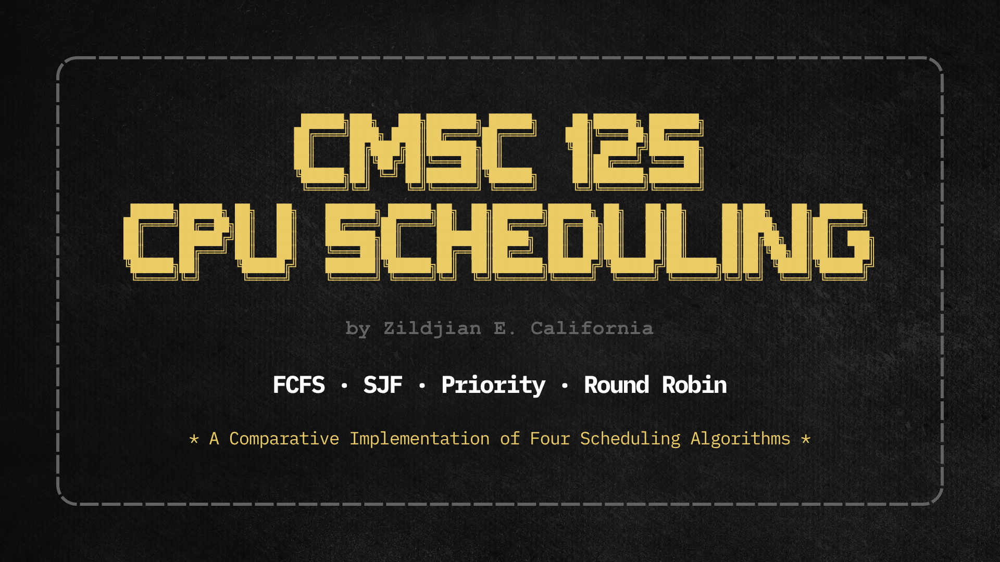

# CMSC 125 - CPU Scheduling

A comparative implementation of four CPU scheduling algorithms in C/C++ for CMSC 125.



## Overview

This repository is for an individual academic assignment focused on implementing, running, and comparing:

- First Come First Serve (FCFS)
- Shortest Job First (SJF)
- Priority Scheduling
- Round Robin (RR)

The assignment requires each algorithm to be implemented in its own C or C++ source file, executed with custom input data, and documented in a short report that compares the resulting scheduling metrics.

## Status

- Version: `0.0.2` (license baseline established)
- Assignment type: `INDIVIDUAL`
- Repository description: A comparative implementation of four scheduling algorithms in C for CMSC 125.
- Current tracked state: repository governance/docs are initialized; the expected algorithm source files and final report PDF are not yet tracked in this repository.

## Objective

Implement the different CPU scheduling algorithms on a set of sample processes using C/C++, then compare their:

- average waiting time
- average response time
- average turnaround time

For the assignment rules, FCFS, SJF, and RR should use the same input dataset. Priority Scheduling may use the same dataset or a different one with priority values added.

## Reference Material

The assignment brief points to the following background material:

- CPU Scheduling overview: <https://www.studytonight.com/operating-system/cpu-scheduling>
- FCFS: <https://www.studytonight.com/operating-system/first-come-first-serve>
- SJF: <https://www.studytonight.com/operating-system/shortest-job-first>
- Priority Scheduling: <https://www.studytonight.com/operating-system/priority-scheduling>
- Round Robin: <https://www.studytonight.com/operating-system/round-robin-scheduling>

## Expected Deliverables

This repository is set up for the following submission outputs:

1. Four source files, one per algorithm.
2. One PDF report containing labeled screenshots and the comparison write-up.
3. One ZIP archive containing the four source files plus the PDF.

If the naming convention follows the maintainer surname in this repository, the expected filenames would be:

- `california_fcfs.c` or `california_fcfs.cpp`
- `california_sjf.c` or `california_sjf.cpp`
- `california_prio.c` or `california_prio.cpp`
- `california_rr.c` or `california_rr.cpp`
- `california_rfm.pdf`

## Current Repository Contents

The repository currently contains:

- root governance and repository-policy documents
- `LICENSE.txt` for repository-owned material
- detailed version notes at `docs/version-0.0.1-docs.md` and `docs/version-0.0.2-docs.md`
- `THIRD-PARTY-NOTICES.md`
- the screenshot asset at `repo/images/project_screen.png`

Implementation files for the four scheduling algorithms and the final report PDF still need to be added.

## Getting Started

### Prerequisites

You need one working C or C++ compiler, for example:

- GCC via MinGW-w64
- Clang
- Microsoft Visual C++ build tools

### Suggested workflow

1. Create one source file per algorithm using the required naming convention.
2. Replace the sample process data with your own dataset.
3. Keep the FCFS, SJF, and RR inputs identical so the metric comparison is fair.
4. Run each program and capture clearly labeled screenshots.
5. Write the comparison summary for waiting, response, and turnaround times.
6. Package the deliverables into a ZIP file for submission.

### Example compile and run commands

Using GCC for a C source file on Windows PowerShell:

```powershell
gcc .\california_fcfs.c -o .\california_fcfs.exe
.\california_fcfs.exe
```

Using G++ for a C++ source file on Windows PowerShell:

```powershell
g++ .\california_fcfs.cpp -o .\california_fcfs.exe
.\california_fcfs.exe
```

Repeat the same pattern for `sjf`, `prio`, and `rr`.

## Submission Checklist

- One source file exists for each required algorithm.
- FCFS, SJF, and RR use the same test data.
- Priority Scheduling includes valid priority input.
- Program runs are captured with labeled screenshots.
- The PDF includes both screenshots and the written comparison.
- The ZIP archive contains the four source files and the PDF only.

## Notes

- Repository-owned material is distributed under the MIT License. See `LICENSE.txt`.
- `THIRD-PARTY-NOTICES.md` is present and should be preserved when adding third-party material.
- Version-specific repository setup notes are documented in `docs/version-0.0.1-docs.md` and `docs/version-0.0.2-docs.md`.

## License

This repository uses the MIT License for repository-owned material.
See `LICENSE.txt` for the full text.

## Maintainer

- Maintainer: Zildjian E. California
- Email: <zecalifornia@up.edu.ph>
- GitHub: <https://github.com/zcalifornia-ph/cmsc-125-cpu-scheduling>
- LinkedIn: <https://www.linkedin.com/in/zcalifornia/>
- ORCID: <https://orcid.org/0009-0002-2357-7606>
- ResearchGate: <https://www.researchgate.net/profile/Zildjian-California>
- Twitter/X: <https://twitter.com/zcalifornia_>
